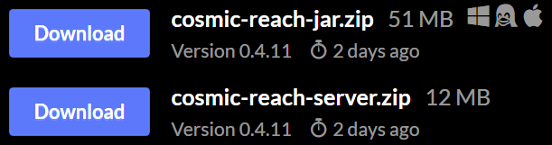

# Contributing

> [!IMPORTANT]
> Active development is moving. This repository may still receive infrequent
> updates for legacy toolings. [Click here to visit the new repo.](https://github.com/PuzzlesHQ/CRArchive/releases)

The starting sections aim to convey some information about Cosmic Reach's
technical development cycle. [You may click this to skip these sections.](#downloading) 

## Development Phases

CosmicArchive's file structure is organized by development phases. The following
are the current version ranges under a specific phase:

|    Phase     |         Range          | Folder Name | Identifier  |
|:------------:|:----------------------:|:-----------:|:-----------:|
|  Pre-Alpha   | `0.0.1`&mdash;`0.3.27` | `pre-alpha` | `pre_alpha` |
|    Alpha     |   `0.4.0` to present   |   `alpha`   |   `alpha`   |
| Full Release |   not yet available    |             |             |

Folder name separator uses dashes `-`. The internal identifier is delimited by
<u>underscores</u> `_` and is used in [versions.json] and [versions_v2.json].

[versions.json]: ./versions.json
[versions_v2.json]: ./versions_v2.json

## Update Phase

Cosmic Reach may sometimes enter update phases. There are two identified and is
used by CosmicArchive: `snapshot` and `release`. Snapshot versions are often
experimental versions before a more relatively stable release. These include
various versions exclusively available on the official Discord, such as the
integrated GPU testing and the multiplayer snapshots.

## Downloading

The latest game <abbr title="Java Archive">JAR</abbr> can be found on [Cosmic
Reach's itch.io page]. Be sure to download `cosmic-reach.jar.zip` to extract the
client <abbr>JAR</abbr> and `cosmic-reach-server.zip` for the server
<abbr>JAR</abbr>.

[Cosmic Reach's itch.io page]: https://finalforeach.itch.io/cosmic-reach

These are then placed in their respective folders:
- `./versions/<phase>/<version>/client` for the client <abbr>JAR</abbr>
- `./versions/<phase>/<version>/server` for the server <abbr>JAR</abbr>

## Versions Files

These files list all the versions along with their download information. There
are two versions.

There is a utility available to aid in generating a version entry; the latest
entry is still manual. Visit the version utility at: https://github.com/CRModders/VersionsGen

### versions.json

* root object
  * `latest` object
    * `<type>` key: `<version>` string value
    * `alpha` key: latest alpha `<version>` string value
    * `pre_alpha` key: latest pre-alpha `<version>` string value
  * `versions` array
    * object element
      * `id` key: `<version>` string value
      * `type` key: `<phase>` string value
      * `releaseTime` key: `<unix-timestamp>` int value
      * `client` key: object value
        * `url` key: `<download-link>` string value
        * `sha256` key: `<sha256>` string value
        * `size` key: `<byte-size>` int value
      * `server` key: object value
          * `url` key: `<download-link>` string value
          * `sha256` key: `<sha256>` string value
          * `size` key: `<byte-size>` int value

### versions_v2.json

The only difference between the first version is that `type` now refers to the
update phase, which is either `release` or `snapshot`, with the phase now stored
in the `phase` key.

* root object
    * `latest` object
        * `<type>` key: `<version>` string value
        * `alpha` key: latest alpha `<version>` string value
        * `pre_alpha` key: latest pre-alpha `<version>` string value
    * `versions` array
        * object element
            * `id` key: `<version>` string value
            * `type` key: `[release|snapshot]` string value
            * `phase` key: `<phase>` string value
            * `releaseTime` key: `<unix-timestamp>` int value
            * `client` key: object value
                * `url` key: `<download-link>` string value
                * `sha256` key: `<sha256>` string value
                * `size` key: `<byte-size>` int value
            * `server` key: object value
                * `url` key: `<download-link>` string value
                * `sha256` key: `<sha256>` string value
                * `size` key: `<byte-size>` int value

## Changelogs

These files have the least priority in the maintaining the archive. It is still
convenient to keep these up-to-date to keep the repository sane and consistent. 

There are two files updated to record the changelogs for each version: one in
the [README.md] and one in [changelogs.json]. The README changelog is
human-readable and usually mirrors the actual changelogs found on Discord. The
`changelogs.json` is geared towards parsers, the formatting is kept though any
nested lists are flattened.

[changelogs.json]: ./changelogs.json
[README.md]: ./README.md

### changelogs.json

Changelogs are grouped by version phase. Note that pre-alpha is considered alpha
only to `changelogs.json`.

* root object
  * `<phase>` key: object value
    * `<version>` key: array value
      * `<changelog-entry>` string element
  * `alpha` key: object value
      * alpha or pre-alpha `<version>` key: array value
          * `<changelog-entry>` string element
